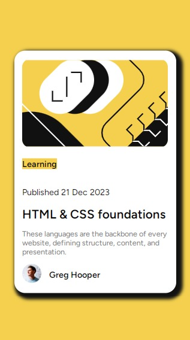
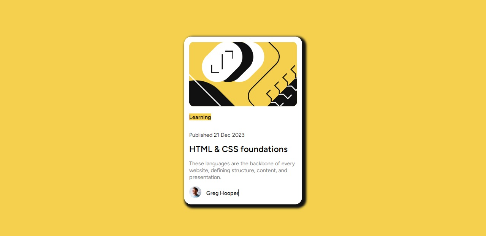

# Frontend Mentor - Blog preview card solution

This is a solution to the [Blog preview card challenge on Frontend Mentor](https://www.frontendmentor.io/challenges/blog-preview-card-ckPaj01IcS). Frontend Mentor challenges help you improve your coding skills by building realistic projects.

## Table of contents

- [Overview](#overview)
  - [The challenge](#the-challenge)
  - [Screenshot](#screenshot)
  - [Links](#links)
- [My process](#my-process)
  - [Built with](#built-with)
  - [What I learned](#what-i-learned)
  - [Continued development](#continued-development)
- [Author](#author)

## Overview

### The challenge

Users should be able to:

- See hover and focus states for all interactive elements on the page

### Screenshot

### Links

- Solution URL: [https://github.com/Homorkhay/blog-preview-card-challenge]
- Live Site URL: [https://blog-preview-crd.netlify.app/]

## My process

### Built with

- Semantic HTML5 markup
- CSS custom properties

### What I learned

It's been months since I did anything related to coding & programming. Thanks to this project, I gained back my confidence and I learned new stuff the transform: translate() property to center a div.

### Continued development

Before I quit coding & programming for a while, I'm already learning grid . I would have taken up a better project on frontendmentor  I want to further my learning with SASS css preprocessor and use it for my next project.
Honing my skills in this area:
Grid
SASS for further development

### Useful resources

- [aptlearn](https://www.aptlearn.com) - Significantly learned a lot on box model. Very helpful site.
- [LearnVern](https://learnvern.com) - Very helpful.

## Author

- Frontend Mentor - [@Homorkhay](https://www.frontendmentor.io/profile/Homorkhay)
- Twitter - [@homorkhay](https://www.twitter.com/homorkhay)
